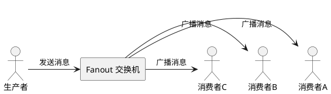

---
## 1. 什么是 Fanout Exchange

**Fanout Exchange（扇出交换机）** 是 RabbitMQ 中最简单的 Exchange 类型，核心行为是**广播**：将收到的消息无条件复制并发送到所有绑定的队列，完全忽略 Routing Key。



**核心特点：**

- **广播**：每个绑定队列都会收到**完全相同**的消息副本，互相独立；
- **忽略 Routing Key**：Binding Key 填什么都不影响路由结果，通常留空；
- **高性能**：无需匹配路由键，路由逻辑最简单，性能最高；
- **无绑定即丢弃**：若没有任何队列绑定，消息直接丢弃。

> [!tip] 与工作队列的区别
>  工作队列中多个消费者**竞争**同一队列，一条消息只给一个人。Fanout 中每个消费者有**自己独立的队列**，一条消息人人都能收到。

## 2. 使用 Spring AMQP 实现

### 2.1. 声明配置（交换机 + 队列 + 绑定）

Spring AMQP 推荐通过 `@Configuration` 配置类统一声明 Exchange、Queue 和 Binding，Spring 容器启动时会自动在 RabbitMQ 中创建对应资源。

```java
@Configuration
public class FanoutConfig {

    public static final String EXCHANGE_FANOUT = "camellia.fanout";
    public static final String QUEUE_FANOUT_A  = "camellia.fanout.queueA";
    public static final String QUEUE_FANOUT_B  = "camellia.fanout.queueB";

    // 声明 Fanout 交换机
    @Bean
    public FanoutExchange fanoutExchange() {
        return new FanoutExchange(EXCHANGE_FANOUT);
    }

    // 声明队列 A
    @Bean
    public Queue queueFanoutA() {
        return new Queue(QUEUE_FANOUT_A);
    }

    // 声明队列 B
    @Bean
    public Queue queueFanoutB() {
        return new Queue(QUEUE_FANOUT_B);
    }

    // 绑定队列 A 到交换机
    @Bean
    public Binding bindFanoutA(@Qualifier("queueFanoutA") Queue queue,
                                FanoutExchange exchange) {
        return BindingBuilder.bind(queue).to(exchange);
    }

    // 绑定队列 B 到交换机
    @Bean
    public Binding bindFanoutB(@Qualifier("queueFanoutB") Queue queue,
                                FanoutExchange exchange) {
        return BindingBuilder.bind(queue).to(exchange);
    }
}
```

> [!tip] [[1. Spring @Bean 命名机制]]
>  Spring 中 `@Bean` 方法名就是该 Bean 的唯一 ID。声明多个同类型 Queue 时，`@Qualifier` 通过方法名区分注入目标，避免注入歧义。
>  

### 2.2. 发送消息（生产者）

```java
@Autowired
private RabbitTemplate rabbitTemplate;

public void sendFanout() {
    String exchangeName = FanoutConfig.EXCHANGE_FANOUT;
    for (int i = 1; i <= 5; i++) {
        String message = "Broadcast Message #" + i;
        // Fanout 模式下 routingKey 填空字符串即可，不影响路由
        rabbitTemplate.convertAndSend(exchangeName, "", message);
    }
}
```

**`convertAndSend` 参数说明：**

|参数|说明|
|---|---|
|`exchange`|交换机名称|
|`routingKey`|路由键，Fanout 模式填 `""` 即可|
|`message`|消息体，自动序列化|

### 2.3. 接收消息（消费者）

```java
@Slf4j
@Component
public class FanoutListener {

    @RabbitListener(queues = FanoutConfig.QUEUE_FANOUT_A)
    public void consumerA(String message) {
        log.info("[ConsumerA] Received: {}", message);
    }

    @RabbitListener(queues = FanoutConfig.QUEUE_FANOUT_B)
    public void consumerB(String message) {
        log.info("[ConsumerB] Received: {}", message);
    }
}
```

发送一条消息后，ConsumerA 和 ConsumerB **都会收到**，各自独立处理：

```
[ConsumerA] Received: Broadcast Message #1
[ConsumerB] Received: Broadcast Message #1
```

## 3. 适用场景

| 场景       | 说明                        |
| -------- | ------------------------- |
| **缓存刷新** | 发布商品更新后，同时通知多个服务节点清理本地缓存。 |
| **日志收集** | 一条操作日志同时写入审计系统和监控系统。      |
| **消息推送** | 系统公告同时推送给多个业务模块。          |
| **数据同步** | 主库变更后广播给多个从库或下游服务。        |

> [!warning] 注意 Fanout 不适合需要**选择性投递**的场景。
> 若不同消费者需要接收不同类型的消息，应使用 Direct Exchange 或 Topic Exchange。